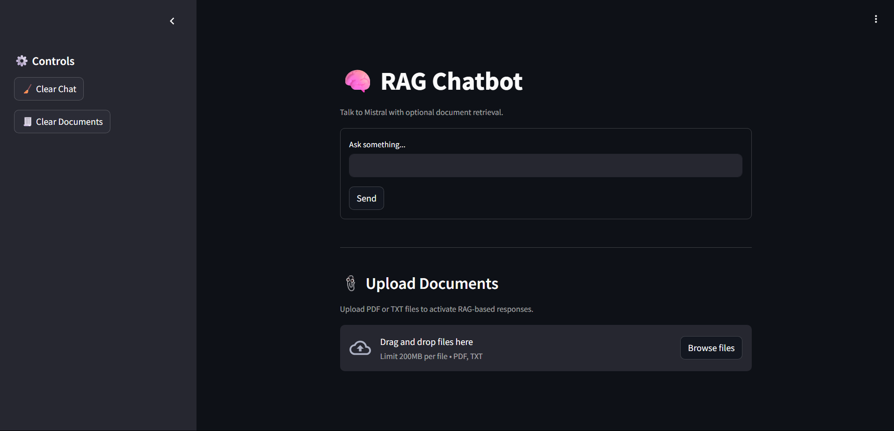
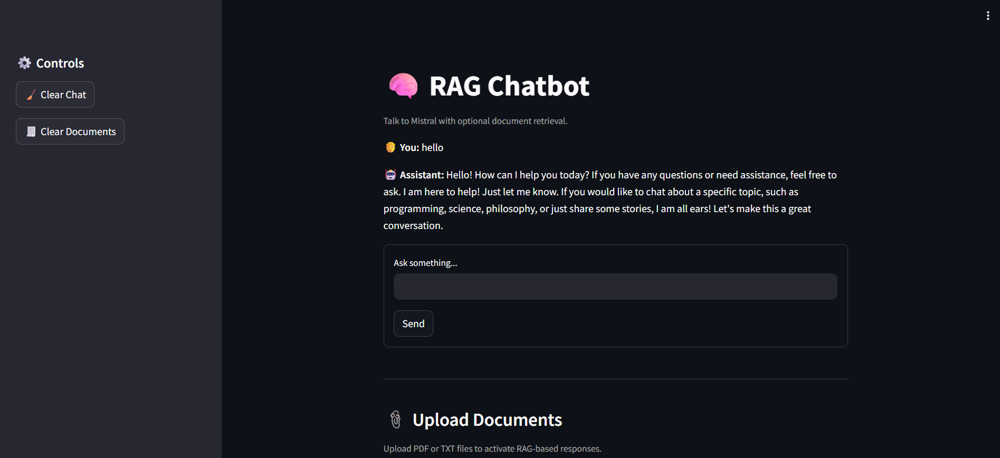
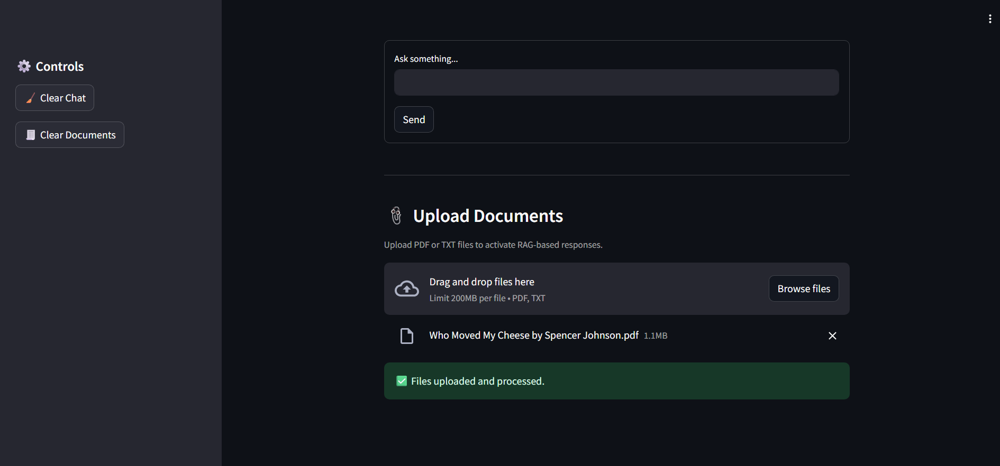
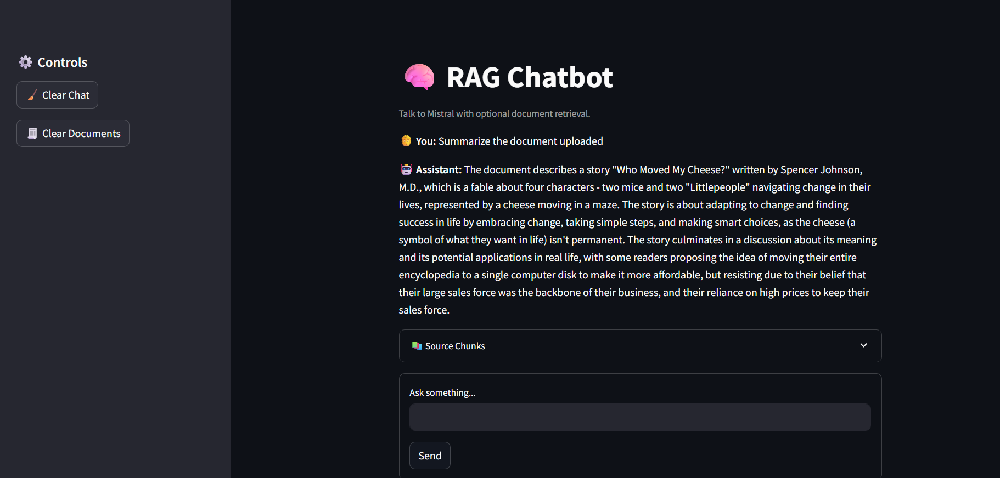

# RAG Chatbot

A lightweight Retrieval-Augmented Generation (RAG) chatbot built with FastAPI, Streamlit, and Mistral 7B. Upload a PDF or text file and ask questions about it — the bot grounds its answers in your document. When no document is loaded, it falls back to the base LLM.

---

## How it works

1. You upload a PDF or TXT file through the Streamlit interface
2. The backend extracts the text, splits it into chunks, and embeds each chunk using `sentence-transformers`
3. Embeddings are stored in a FAISS vector index
4. When you ask a question, the most semantically similar chunks are retrieved and passed to Mistral 7B as context
5. If no relevant chunks are found, the question goes straight to the LLM without added context

---

## Tech stack

| Layer | Technology |
|---|---|
| Backend | FastAPI |
| Frontend | Streamlit |
| Vector store | FAISS |
| Embeddings | sentence-transformers (`all-MiniLM-L6-v2`) |
| LLM | minimax/minimax-m2.5 via [OpenRouter](https://openrouter.ai) |
| Containerization | Docker + Supervisor |
| CI/CD | GitHub Actions |

---

## Prerequisites

- Python 3.10 or newer
- A free [OpenRouter](https://openrouter.ai) API key
- Docker (only needed for the containerized run)

---

## Local setup

**1. Clone the repo**

```bash
git clone https://github.com/yourusername/rag-chatbot.git
cd rag-chatbot
```

**2. Create a `.env` file**

```bash
cp .env.example .env
```

Open `.env` and fill in your OpenRouter key:

```
OPENROUTER_API_KEY=your_key_here
API_URL=http://localhost:8000
ENV=local
```

**3. Install dependencies**

```bash
pip install -r requirements.txt
```

**4. Start the backend**

```bash
uvicorn backend.main:app --reload --port 8000
```

**5. Start the frontend** (new terminal)

```bash
streamlit run frontend/app.py
```

Open [http://localhost:8501](http://localhost:8501) in your browser.

---

## Run with Docker

Both services start automatically inside a single container using Supervisor.

```bash
docker build -t rag-chatbot .
docker run --env-file .env -p 8501:8501 rag-chatbot
```

Open [http://localhost:8501](http://localhost:8501).

---

## Deploy to Render for free

[Render](https://render.com) offers a free tier for Docker-based web services. Your app will be publicly accessible at a `*.onrender.com` URL — no credit card required.

> **Note on the free tier:** containers spin down after 15 minutes of inactivity and take about 30 seconds to wake up on the next request. This is perfectly fine for a portfolio project.

**Step 1 — Push your code to GitHub**

Make sure `.env` is listed in `.gitignore` (it already is). Push your repo to GitHub.

**Step 2 — Create a Render account**

Sign up at [render.com](https://render.com) and connect your GitHub account.

**Step 3 — Create a new Web Service**

- Click **New → Web Service**
- Select your repository
- Set **Runtime** to `Docker`
- Set **Port** to `8501`
- Leave Build Command and Start Command blank — the `Dockerfile` handles everything

**Step 4 — Add environment variables**

In the Render dashboard under **Environment**, add:

| Key | Value |
|---|---|
| `OPENROUTER_API_KEY` | Your OpenRouter key |
| `API_URL` | `http://localhost:8000` |
| `ENV` | `prod` |

The `API_URL` is `http://localhost:8000` because both services run inside the same container. The FastAPI backend is not publicly exposed — only the Streamlit frontend (port 8501) is.

**Step 5 — Deploy**

Click **Save and Deploy**. Render will build the image and give you a live URL.

---

## Project structure

```
rag-chatbot/
├── backend/
│   ├── main.py             # FastAPI app entry point, router registration
│   ├── chat_router.py      # POST /chat — handles questions
│   ├── upload_router.py    # POST /upload — processes uploaded files
│   ├── status_router.py    # GET /status, POST /status/clear
│   ├── document_store.py   # Shared state: chunks, hashes, FAISS index
│   ├── retriever.py        # FAISS index creation and similarity search
│   ├── embedding.py        # sentence-transformers wrapper
│   ├── llm.py              # OpenRouter API call
│   ├── memory.py           # In-memory chat history helpers
│   └── text_utils.py       # PDF text extraction and chunk splitting
├── frontend/
│   ├── app.py              # Main Streamlit UI
│   └── utils.py            # Chat display helpers
├── .streamlit/
│   └── config.toml         # Streamlit server settings
├── .github/
│   └── workflows/
│       └── docker-ci.yml   # GitHub Actions: build and push on push to main
├── .env.example            # Environment variable template
├── .gitignore
├── Dockerfile              # Single image for both services
├── supervisord.conf        # Runs backend + frontend as supervised processes
├── requirements.txt
└── README.md
```

---

## Environment variables

| Variable | Description | Default |
|---|---|---|
| `OPENROUTER_API_KEY` | Your OpenRouter API key | — (required) |
| `API_URL` | Base URL of the FastAPI backend | — (required) |
| `ENV` | `local` loads `.env` automatically; `prod` skips it | `local` |

---

## API endpoints

| Method | Path | Description |
|---|---|---|
| `GET` | `/` | Health check |
| `POST` | `/chat` | Send a message, receive a response |
| `POST` | `/upload` | Upload one or more PDF/TXT files |
| `GET` | `/status` | Check how many chunks are loaded |
| `POST` | `/status/clear` | Clear all loaded documents |

---

## Screenshots

### Home


### Chatting with the LLM


### Uploading a document


### RAG-grounded chat


---

## License

MIT © Abhishek Sahukar
