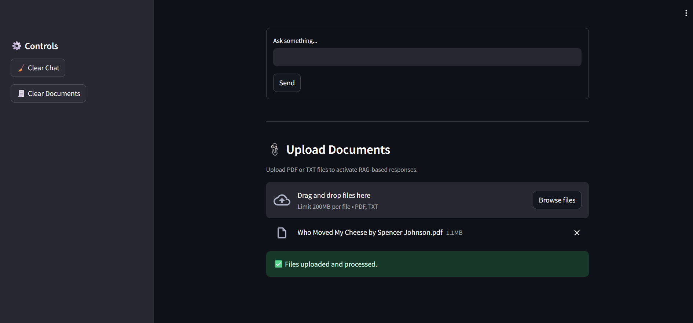

# RAG Chatbot Assistant (FastAPI + Streamlit + Mistral 7B via OpenRouter)

A lightweight **Retrieval-Augmented Generation (RAG)** chatbot that combines the power of **Mistral 7B** for intelligent responses and integrates document-based context retrieval using **FAISS**.

---

##  Features

- RAG-enabled question answering (PDF / TXT document upload)
- Interactive Streamlit frontend with real-time chat history
- FastAPI backend handling LLM & document processing
- FAISS vector store with `sentence-transformers` embeddings
- `.env`-based secure API key injection
- Azure Container Apps deployment (single or dual container)
- Dockerized backend + frontend stack

---

##  Tech Stack

| Layer        | Technology               |
| Backend      | FastAPI, FAISS, PyMuPDF  |
| Frontend     | Streamlit                |
| Embeddings   | sentence-transformers    |
| LLM Provider | Mistral 7B via OpenRouter |
| DevOps       | Docker, Azure Container Apps, GitHub Actions (optional) |

---

## 🚀 Quick Start (Local)

1. Clone the repo
bash
git clone https://github.com/yourusername/rag-chatbot.git
cd rag-chatbot

2. Set up .env
# .env
OPENROUTER_API_KEY=your_openrouter_api_key
API_URL= "URL"
ENV=local

3. Install dependencies
pip install -r requirements.txt

4. Run services
# Run FastAPI backend
uvicorn backend.main:app --reload --port 8000

# In a new terminal: Run Streamlit frontend
streamlit run frontend/app.py

##  Run with Docker ##

1. Build image
docker build -t rag-chatbot .

2. Run container
docker run --env-file .env -p 8000:8000 -p 8501:8501 rag-chatbot

## Azure Deployment (Container Apps) ##
Prerequisites
1.Azure CLI logged in
2.ACR (Azure Container Registry) created
3.Azure Container App Environment created

## Steps ##
1. Push image to ACR
az acr build --registry <your_acr_name> --image rag-chatbot:latest .

2. Create Container App
az containerapp create \
  --name rag-chatbot-app \
  --resource-group <your_rg> \
  --environment <your_env> \
  --image <acr_name>.azurecr.io/rag-chatbot:latest \
  --target-port 8501 \
  --ingress external \
  --registry-server <acr_name>.azurecr.io \
  --env-vars \
     OPENROUTER_API_KEY=<your_api_key> \
     API_URL="URL" \
     ENV=prod

3. Testing
- Upload a .pdf or .txt file via the Streamlit UI
- Ask a question related to the content
- If matching chunks are found → used RAG + shows chunks
- If not → fallback to direct LLM

## Screenshots ##

###  Streamlit UI (Homepage)

### Chat 

### RAG-Document Upload

### RAG-Chat

License
MIT © Abhishek Sahukar

This project was inspired by the open-source AI community and built with technologies like FastAPI, Streamlit, FAISS, and Azure.